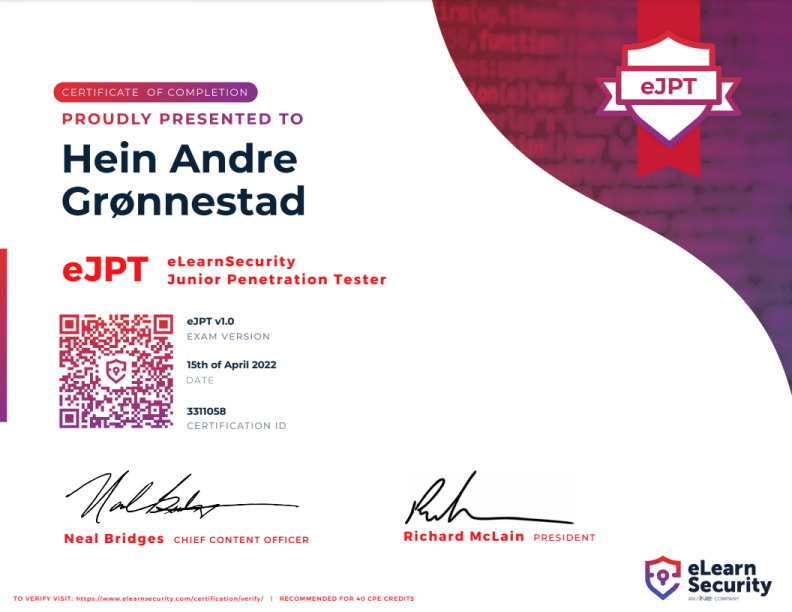

### Hi! :)

This page acts as a casual résumé and showcase of my hobby projects and interests.

#### [`#hobby-projects`](#hobby-projects) [`#info-sec`](#information-security) [`#ctf`](#ctf-writeups) [`#tryhackme`](#tryhackme) [`#other-links`](#other-links)

## Hobby Projects

- [Whack-An-Ernst (Stream Deck Game)](streamdeck-whack-an-ernst)
- [IKEA Trådfri Stream Deck Plugin](streamdeck-tradfri)
- [Commodore 64 Emulator](retro-computing)
- [The Retro Hour Commodore 64 Episode Guide](c64-retro-hour)
- [`c64matrix`](c64matrix)
- [Nissan Leaf IoT Dashboard](leaf-display)
- [Ludum Dare 46 - A Wizard Worth Fighting For](https://github.com/hagronnestad/LD46)
- [N*xtion Font Editor](https://github.com/hagronnestad/nextion-font-editor)
  - Reverse engineering and documentation of the `.zi` font format. Also includes a generator and an editor.
- [Some Of My 3D Models For 3D Printing](https://github.com/hagronnestad/3d-print-models)
  - [Printables](https://www.printables.com/social/247057-hag/about)
  - [Thingiverse](https://www.thingiverse.com/heinandre/designs)
- [COM Port Proxy](com-port-proxy)
- [KAIFA MA105H2E Smart Meter MBUS Interface PoC](mbus-han-kaifa)

## Information Security

I have a deep understanding of computer systems and information security, both as a software engineer and as a red team ethical hacker.

### eJPT Certification

I am a certified eLearnSecurity Junior Penetration Tester. 

*Certificate Verification: [https://www.elearnsecurity.com/certification/verify?c=751496b8-eada-4937-b04e-2a160c5a8e10](https://www.elearnsecurity.com/certification/verify?c=751496b8-eada-4937-b04e-2a160c5a8e10)*

### CTF Writeups

I sometimes participate in [CTFs](https://en.wikipedia.org/wiki/Capture_the_flag_(cybersecurity)). Here are some of my writeups from past ones:

| Year | Name                            | Team | Repo                                                                             | Placement                             |
|------|---------------------------------|------|----------------------------------------------------------------------------------|---------------------------------------|
| 202x | TryHackMe                       | hag  | [ctf-thm-public](https://heinandre.no/ctf-thm-public/)                           | [Top 1%](https://tryhackme.com/p/hag) |
| 2022 | Sikkerhets-dagen 2022 CTF @ UiA | hag  | [ctf-uia-no-2022](https://heinandre.no/ctf-uia-no-2022/)                         | 6th overall / 3rd by points (offsite) |
| 2022 | HTB Cyber Apocalypse 2022       | hag  | [htb-cyber-apocalypse-2022](https://heinandre.no/htb-cyber-apocalypse-2022/)     | 883 / 7024                            |
| 2021 | River Security Xmas Challenge   | hag  | [ctf-rsxc-2021](https://github.com/hagronnestad/ctf-rsxc-2021)                   |                                       |
| 2021 | Equinor CTF                     | IK   | [ctf-equinor-21](https://github.com/hagronnestad/ctf-equinor-21)                 | 12 / 79                               |
| 2021 | OP Holmgang                     | IK   | [ctf-op-holmgang](https://github.com/hagronnestad/ctf-op-holmgang)               | 22 / 188                              |
| 2021 | H@ctivityCon                    | hag  | [ctf-hacktivitycon-2021](https://github.com/hagronnestad/ctf-hacktivitycon-2021) | 210 / 2527                            |

### TryHackMe

I regularly use [TryHackMe](https://tryhackme.com/) to practice me ethical hacking skills and learn new ones:

- [My TryHackMe Writeups](ctf-thm-public)
- [My TryHackMe Profile](https://tryhackme.com/p/hag)

### Other Links

- [GitHub](https://github.com/hagronnestad/)
- [LinkedIn](https://www.linkedin.com/in/heinandre/)
